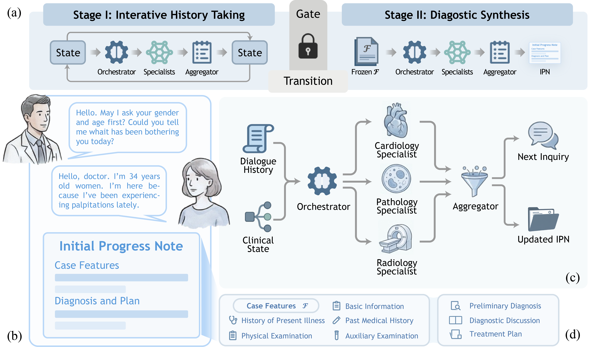

# [ACL 2026 Findings] Beyond the Individual: Virtualizing Multi-Disciplinary Reasoning for Clinical Intake via Collaborative Agents

**Aegle** is a graph-based, multi-agent framework that virtualizes multidisciplinary clinical reasoning for outpatient intake. It coordinates an orchestrator, specialist agents, an aggregator, and a standardized patient to conduct evidence-grounded dialogue and generate structured Initial Progress Notes in clinical standard document format.

<p align="center">
  
</p>

## 🌟 Highlights

- **Virtual MDT for clinical intake:** Aegle brings multidisciplinary reasoning into real-time outpatient consultation through collaborative agents.
- **State-aware, two-stage reasoning:** It separates evidence collection from diagnostic synthesis to improve traceability and reduce premature diagnostic bias.
- **Dynamic specialist activation:** An orchestrator activates specialists on demand, then an aggregator integrates decoupled parallel opinions into a coherent note.
- **Strong empirical results:** Aegle is evaluated across 24 departments and 53 metrics, consistently improving documentation quality and consultation capability, with higher final diagnosis accuracy.

## 🛠️ Installation

1. Clone the repository

```bash
git clone https://github.com/HovChen/Aegle.git
cd Aegle
```

2. Prepare Python environment

Create a virtual environment with `uv`:

```bash
uv sync
```

## ⚙️ Configuration

Set API-related variables in your shell or `.env`:

- `DEEPSEEK_API_KEY`
- `DEEPSEEK_BASE_URL` (optional)

## 🚀 Quick Start

Run an example case:

```bash
python run_aegle.py \
  --case-id 0 \
  --max-turns 3 \
  --concurrency 1 \
  --cases-dir "./playground/example_data" \
  --output-dir "./playground/output"
```

## 📂 Data Format

`--cases-dir` should include:

```text
<cases-dir>/
├── index.json
└── cases/
    └── *.json
```

`index.json` example:

```json
[
  {
    "case_id": 0,
    "path": "cases/case0.json"
  }
]
```

Case file example:

```json
{
  "case_id": 0,
  "extracted": {
    "basic_info": "...",
    "present_illness": "...",
    "past_history": "...",
    "physical_exam": "...",
    "aux_exam": "..."
  }
}
```

## 🤝 Acknowledgment

This project is built with and inspired by the open-source ecosystem, including:

- [LangChain](https://github.com/langchain-ai/langchain)
- [LangGraph](https://github.com/langchain-ai/langgraph)

## 🖊️ Citation

If you find Aegle helpful in your research, please cite our paper:

```bibtex
@misc{chen2026beyond,
      title={Beyond the Individual: Virtualizing Multi-Disciplinary Reasoning for Clinical Intake via Collaborative Agents}, 
      author={Huangwei Chen and Wu Li and Junhao Jia and Yining Chen and Xiaotao Pang and Ya-Long Chen and Li Gonghui and Haishuai Wang and Jiajun Bu and Lei Wu},
      year={2026},
      eprint={2604.08927},
      archivePrefix={arXiv},
      primaryClass={cs.MA},
      url={https://arxiv.org/abs/2604.08927}, 
}
```
